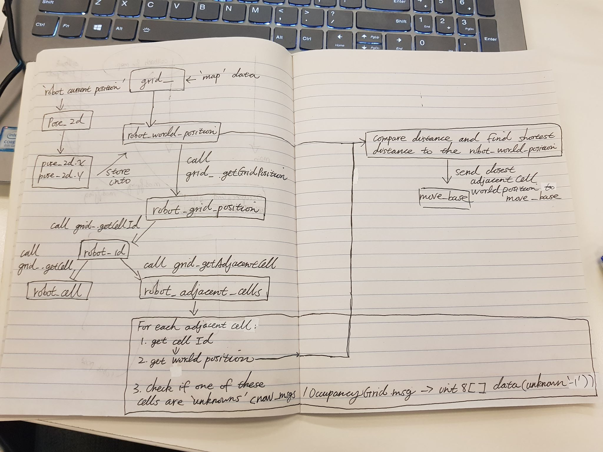

# Week 10

## Mon 23 Sep 2020

* Per Maleen’s instructions, I need to create 2 custom yaml files (One for the global_cost_map and one for the local_cost_map) 
* `The key is to change the static_map parameter to ‘false’`. If static_map is set to true, move_base will expect a map is being provided to it and will perform computations relying on a externally supplied map, if the static_map is set as false, move_base will navigate based on the information supplied by the ‘gmapping’ package
* I have also created a ROS launch file that allows me to launch the move_base node as well as load the two aformentioned parameter files. 

**Result**

With Maleen’s assitance, the ‘Robot out of global costmap’ warning is no longer present, and now I am able to give the move_base actionclient an arbitatary pose (in the ‘map’ frame) and have it travel to that pose. Now the next step of this project is to implement some sort of frontier-based exploration algorithm so that the move_base node will be able to receive goals autonomously. 

## Tue 24 Sep 2020

Prepared for the mid-project milstone preparation (using the marking form supplied by Alen as a guideline) 

## Wed 25 Sep 2020

* Used code from a previous assignment that includes a contructor which constructs an Occupancy Grid type object and with it consists of many methods (namely occupancy state determination, boundary detection and adjacent cell calculation) 
* Will be attempting to ultilize and modify this code to ultilze the data acquired from gmapping to create a map and subsequently use it to commence the path planning section of the project 

## Thu 26 Sep 2020

* Altered the header file for the Occupancy Grid Class Code mentioned above to suit this assignment. This allows me to create an Occupancy Grid object called ‘Grid_’ that will be taking data from the ‘map’ topic within gmapping to create a map. (Refer to robot_mover_backup.cpp) 
* This Occupancy Class code already has methods implemented that allows me to convert the occupancy grid map into cells and also convert between the cells grid position (grid_position) & world position (world_position) and more importantly find the list of cells that are ‘adjacent’,  ‘not occupied ‘ and ‘not out of bounds’ to the robot 
* Because there were no methods to update the occupancy grid map direction, I must within my robot_mover’s main loop code, create -> update -> destroy a new occupancy grid as the robot is moving. Therefore to protect ‘grid_’ a mutex is used to protect it 

**What is the current state of the project as of today ?** 
The catkin_make with the new code was successfull with no errors, however need to ask the tutors about one line of code –  `//OccupancyGrid grid_; //you need to define this variable in the .h file`

**What’s next ?**
* Implement below [flow chart diagram](./images/wk10_schematic.png) in code form to determine frontier points and consequently goals for ‘move_base’

